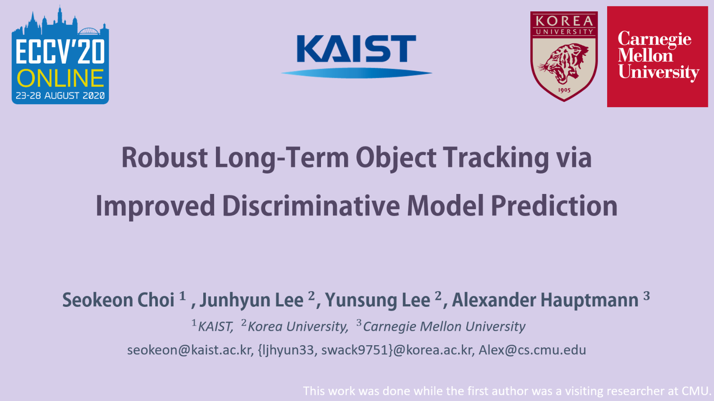
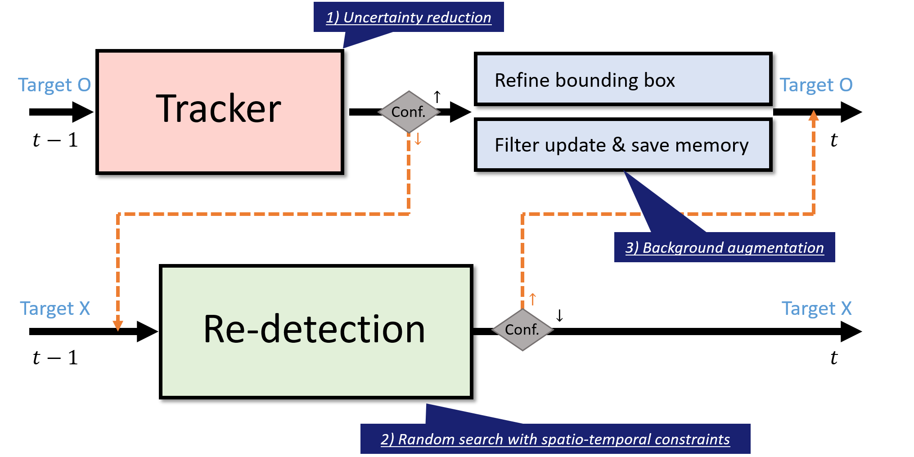
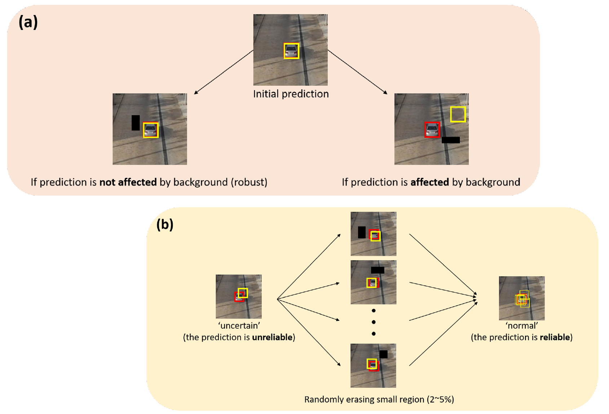
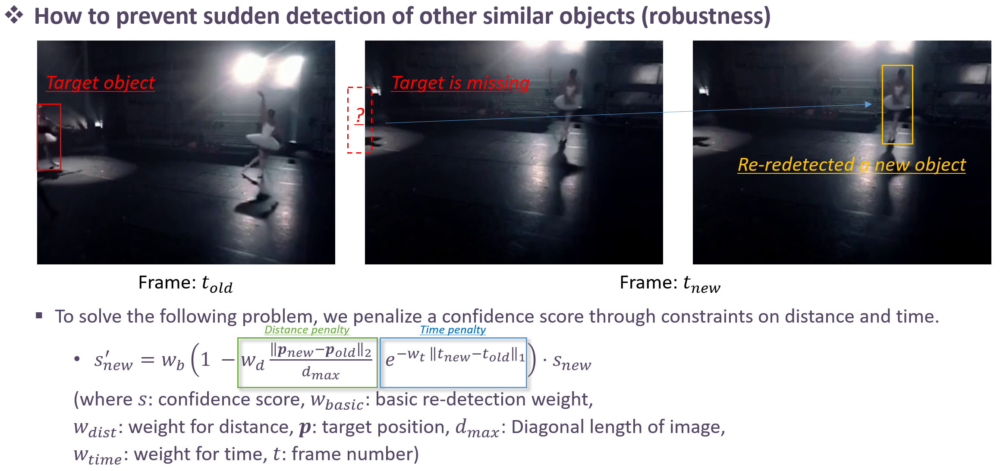
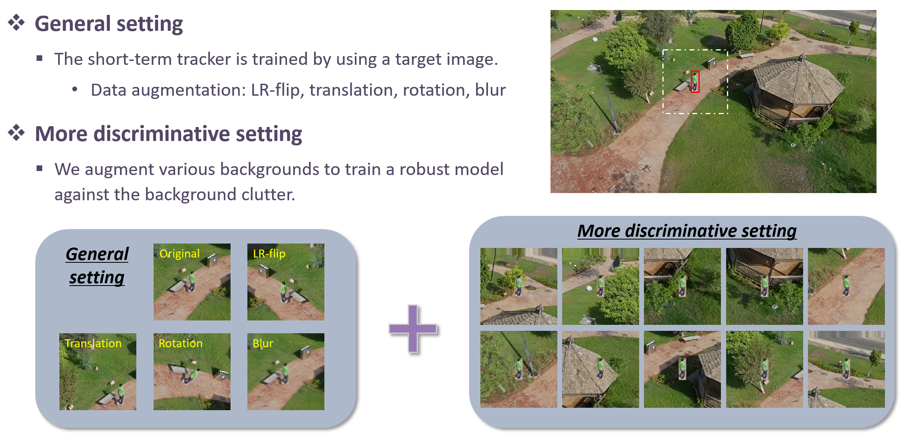

**Feel free to visit my [homepage](https://sites.google.com/site/seokeonchoi/)**

## Robust Long-Term Object Tracking via Improved Discriminative Model Prediction (RLT-DIMP) [[ECCVW2020 paper](https://arxiv.org/abs/2008.04722)]



----
### Presentation video


**1-minute version (ENG)**

[](https://www.youtube.com/watch?v=Yp0HiKvV8F4)

**12-minute version (ENG)**

[](https://www.youtube.com/watch?v=dm3_CwkEy3M)


---
### Summary

#### <Abstract>

We propose an improved discriminative model prediction method for robust long-term tracking based on a pre-trained short-term tracker. The baseline pre-trained short-term tracker is SuperDiMP which combines the bounding-box regressor of PrDiMP with the standard DiMP classifier. Our tracker RLT-DiMP improves SuperDiMP in the following three aspects: (1) Uncertainty reduction using random erasing: To make our model robust, we exploit an agreement from multiple images after erasing random small rectangular areas as a certainty. And then, we correct the tracking state of our model accordingly. (2) Random search with spatio-temporal constraints: we propose a robust random search method with a score penalty applied to prevent the problem of sudden detection at a distance. (3) Background augmentation for more discriminative feature learning: We augment various backgrounds that are not included in the search area to train a more robust model in the background clutter. In experiments on the VOT-LT2020 benchmark dataset, the proposed method achieves comparable performance to the state-of-the-art long-term trackers.


---
#### <Framework>
  


---

#### <Baseline>

- We adopt the pre-trained short-term tracker which combines the bounding box regressor of PrDiMP with the standard DiMP classifier
- This tracker's name is SuperDiMP and it can be downloaded on the DiMP-family's github page [[link](https://github.com/visionml/pytracking/blob/master/MODEL_ZOO.md#Models)


---
#### <Contribution1: Uncertainty reduction using random erasing>


---
#### <Contribution2: Random search with spatio-temporal constraints>


---
#### <Contribution3: Background augmentation for more discriminative learning>



---
### Prerequisites

- Ubuntu 18.04 / Python 3.6 / CUDA 10.0 / gcc 7.5.0
- Need anaconda
- Need GPU (more than 2GB, Sometimes it is a little more necessary depending on the situation.)
- Unfortunately, "Precise RoI Pooling" included in the Dimp tracker only supports GPU (cuda) implementations.
- Need root permission
- All libraries in “install.sh” file (please check “how to install”)

---
### How to install 

- Unzip files in `$(tracker-path)`
- cd `$(tracker-path)`
- bash install.sh `$(anaconda-path)` `$(env-name)` (Automatically create conda environment, If you don’t want to make more conda environments, run “bash install_in_conda.sh” after conda activation)
- check pretrained model "super_dimp.pth.tar" in `$(tracker-path)$/pytracking/networks/` (It should be downloaded by install.sh)
- conda activate `$(env-name)`
- make VOTLT2020 workspace (vot workspace votlt2020 --workspace `$(workspace-path)`)
- move trackers.ini to `$(workspace-path)`
- move(or download) votlt2020 dataset to `$(workspace-path)/sequences`
- set the VOT dataset directory (`$(tracker-path)/pytracking/evaluation/local.py`), vot_path should include ‘sequence’ word (e.g., `$(vot-dataset-path)/sequences/`), vot_path must be the absolute path (not relative path)
- modify paths in the trackers.ini file, paths should include ‘pytracking’ word (e.g., `$(tracker-path)/pytracking`), paths must be absolute path (not relative path)
- cd `$(workspace-path)`
- vot evaluate RLT_DiMP --workspace `$(workspace-path)`
- It will fail once because the “precise rol pooling” file has to be compiled through the ninja. Please check the handling error parts.
- vot analysis --workspace `$(workspace-path)` RLT_DiMP --output json


---
### Handling errors

- “Process did not finish yet” or “Error during tracker execution: Exception when waiting for response: Unknown”-> re-try or “sudo rm -rf `/tmp/torch_extensions/_prroi_pooling/`”
- About “groundtruth.txt” -> check vot_path in the `$(tracker-path)/pytracking/evaluation/local.py` file
- About “pytracking/evaluation/local.py” -> check and run install.sh
- About “permission denied : “/tmp/torch_extensions/_prroi_pooling/” -> sudo chmod -R 777 `/tmp/torch_extensions/_prroi_pooling/`
- About “No module named 'ltr.external.PreciseRoiPooling’” or “can not complie Precise RoI Pooling library error” -> cd `$(tracker-path)` -> rm -rf `/ltr/external/PreciseRoiPooling` -> git clone https://github.com/vacancy/PreciseRoIPooling.git `ltr/external/PreciseRoIPooling`
- If nothing happens since the code just stopped -> sudo rm -rf `/tmp/torch_extensions/_prroi_pooling/`


---
### Contact

If you have any questions, please feel free to contact seokeon@kaist.ac.kr

---

### Acknowledgments

- The code is based on the PyTorch implementation of the [DiMP-family](https://github.com/visionml/pytracking). 
- This work was done while the first author was a visiting researcher at CMU. 
- This work was supported in part through NSF grant IIS-1650994, the financial assistance award 60NANB17D156 from U.S. Department of Commerce, National Institute of Standards and Technology (NIST) and by the Intelligence Advanced Research Projects Activity (IARPA) via Department of Interior/Interior Business Center (DOI/IBC) contract number D17PC0034. The U.S. Government is authorized to reproduce and distribute reprints for Governmental purposes notwithstanding any copy-right annotation/herein. Disclaimer: The views and conclusions contained herein are those of the authors and should not be interpreted as representing the official policies or endorsements, either expressed or implied, of NIST, IARPA, NSF, DOI/IBC, or the U.S. Government.

---

### Citation 

```
@InProceedings{Choi2020,
  author = {Choi, Seokeon and Lee, Junhyun and Lee, Yunsung and Hauptmann, Alexander},
  title = {Robust Long-Term Object Tracking via Improved Discriminative Model Prediction},
  booktitle={Proceedings of the European Conference on Computer Vision (ECCV)},
  pages={0--0},
  year={2020}
}
```


---
### Reference

- [PrDiMP] Danelljan, Martin, Luc Van Gool, and Radu Timofte. "Probabilistic Regression for Visual Tracking." arXiv preprint arXiv:2003.12565 (2020).
- [DiMP] Bhat, Goutam, et al. "Learning discriminative model prediction for tracking." Proceedings of the IEEE International Conference on Computer Vision. 2019.
- [ATOM] Danelljan, Martin, et al. "Atom: Accurate tracking by overlap maximization." Proceedings of the IEEE Conference on Computer Vision and Pattern Recognition. 2019.
